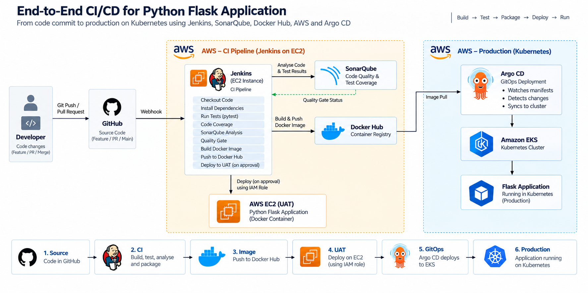

# 🚀 Complete CI/CD Pipeline for Python Flask Application

A complete end-to-end **DevOps CI/CD implementation** for a Python Flask application, demonstrating how application code can move from **GitHub source control to UAT and finally to Production Kubernetes** using Jenkins, SonarQube, Docker Hub, AWS IAM, and Argo CD.

The project implements separate deployment strategies for **UAT** and **Production**, providing a practical example of how CI/CD and GitOps can work together.




---

## 🏗️ Architecture

```text
                         ┌──────────────────┐
                         │     Developer    │
                         │                  │
                         │  Git Push / PR   │
                         └────────┬─────────┘
                                  │
                                  ▼
                         ┌──────────────────┐
                         │     GitHub       │
                         │  Source Control  │
                         └────────┬─────────┘
                                  │
                                  │ Webhook
                                  ▼
                    ┌─────────────────────────┐
                    │        Jenkins          │
                    │                         │
                    │  CI/CD Pipeline         │
                    │                         │
                    │  1. Checkout            │
                    │  2. Build               │
                    │  3. Test                │
                    │  4. SonarQube Analysis  │
                    │  5. Build Docker Image  │
                    │  6. Push Image          │
                    └───────────┬─────────────┘
                                │
                                ▼
                       ┌─────────────────┐
                       │    SonarQube    │
                       │                 │
                       │ Code Quality    │
                       │ Test Coverage   │
                       │ Quality Gate    │
                       └─────────────────┘

                                │
                                │ Docker Image
                                ▼
                       ┌─────────────────┐
                       │    Docker Hub   │
                       │                 │
                       │ Application     │
                       │ Container Image │
                       └────────┬────────┘
                                │
                    ┌───────────┴───────────┐
                    │                       │
                    ▼                       ▼
          ┌──────────────────┐    ┌────────────────────┐
          │       UAT        │    │     Production     │
          │                  │    │                    │
          │ AWS EC2          │    │ Kubernetes Cluster │
          │                  │    │                    │
          │ IAM Role         │    │      Argo CD       │
          │ Assumed by       │    │         │          │
          │ Jenkins          │    │         ▼          │
          │                  │    │ Kubernetes Deploy  │
          └──────────────────┘    └────────────────────┘
```

---

# 📌 Project Overview

This project demonstrates a complete CI/CD lifecycle for a sample **Python Flask application**.

The pipeline is designed around two deployment paths:

### UAT Deployment

Jenkins performs the CI activities, builds the Docker image, pushes it to Docker Hub, and deploys the application to an **AWS EC2-based UAT environment**.

Jenkins accesses AWS resources using an **IAM role assumed by the Jenkins EC2 instance**, avoiding the need to store long-lived AWS access keys in Jenkins.

### Production Deployment

Production follows a **GitOps-based deployment model**.

Instead of Jenkins directly deploying the application to Kubernetes, **Argo CD monitors the desired Kubernetes configuration and synchronizes the application into the Kubernetes cluster**.

This provides a clear separation between:

```text
CI / Build
    ↓
Jenkins
    ↓
Docker Image
    ↓
Docker Hub
    ↓
GitOps Configuration
    ↓
Argo CD
    ↓
Kubernetes
```

---

# 🎯 Project Objectives

The main objectives of this project are to demonstrate:

* Source control using GitHub
* CI/CD using Jenkins
* Automated application testing
* Code quality analysis using SonarQube
* Test coverage measurement
* Docker containerization
* Docker image management using Docker Hub
* AWS IAM role-based authentication
* UAT deployment on AWS EC2
* GitOps-based production deployment
* Kubernetes application deployment
* Argo CD continuous delivery
* Separation of CI and production CD responsibilities

---

# 🛠️ Technology Stack

| Technology         | Purpose                             |
| ------------------ | ----------------------------------- |
| **Python / Flask** | Sample application                  |
| **GitHub**         | Source code management              |
| **Jenkins**        | CI/CD orchestration                 |
| **SonarQube**      | Static code analysis & quality gate |
| **Pytest**         | Application testing                 |
| **Coverage.py**    | Test coverage                       |
| **Docker**         | Application containerization        |
| **Docker Hub**     | Container image registry            |
| **AWS EC2**        | Jenkins and UAT infrastructure      |
| **AWS IAM**        | Secure AWS authentication           |
| **Kubernetes**     | Production container orchestration  |
| **Argo CD**        | GitOps-based Kubernetes deployment  |

---

# 🔄 CI/CD Pipeline Flow

The complete pipeline can be summarized as:

```text
Developer
   │
   │ Git Push / Pull Request
   ▼
GitHub
   │
   │ Webhook
   ▼
Jenkins
   │
   ├── Checkout Source
   │
   ├── Install Dependencies
   │
   ├── Run Unit Tests
   │
   ├── Generate Test Coverage
   │
   ├── SonarQube Analysis
   │
   ├── Quality Gate
   │
   ├── Build Docker Image
   │
   └── Push Image to Docker Hub
               │
               ├───────────────┐
               │               │
               ▼               ▼
             UAT             Production
               │               │
               ▼               ▼
          AWS EC2           Argo CD
                               │
                               ▼
                          Kubernetes
```

---

# 🔍 CI Pipeline

Jenkins is responsible for the Continuous Integration workflow.

The pipeline performs the following major stages:

### 1. Checkout

Jenkins checks out the application source code from GitHub.

```text
GitHub
   ↓
Jenkins
   ↓
Source Code
```

---

### 2. Install Dependencies

Python dependencies required by the Flask application and testing framework are installed.

Typical dependencies include:

```text
Flask
pytest
pytest-cov
```

---

### 3. Run Tests

Automated tests are executed against the Flask application.

Example:

```bash
pytest
```

The pipeline should fail if the application tests fail.

---

### 4. Test Coverage

Test coverage is generated as part of the CI pipeline.

Example:

```bash
pytest --cov=. --cov-report=xml
```

The coverage report is then consumed by SonarQube.

This allows the pipeline to evaluate not only whether tests pass, but also how much of the application code is covered by tests.

---

# 📊 SonarQube Code Quality

SonarQube is integrated into the Jenkins pipeline to perform automated code-quality analysis.

The pipeline sends the source code and coverage information to SonarQube.

SonarQube evaluates areas such as:

* Bugs
* Code smells
* Vulnerabilities
* Code duplication
* Test coverage
* Maintainability
* Reliability

The pipeline can then enforce a **Quality Gate** before continuing to the packaging/deployment stages.

```text
Source Code
     │
     ▼
SonarQube Analysis
     │
     ▼
Quality Gate
     │
 ┌───┴────┐
 │        │
PASS     FAIL
 │        │
 ▼        ▼
Continue  Stop Pipeline
```

This ensures that code-quality validation happens before the application is promoted further through the deployment pipeline.

---

# 🐳 Docker Image Build

After successful testing and code-quality validation, Jenkins builds the application Docker image.

```text
Python Flask Application
          │
          ▼
      Dockerfile
          │
          ▼
    Docker Image
```

The resulting image contains the application and its runtime dependencies, providing a consistent deployment artifact across environments.

---

# 📦 Docker Hub

The Docker image is pushed to Docker Hub after the CI stages successfully complete.

Example:

```text
Docker Build
     │
     ▼
Docker Image
     │
     ▼
Docker Hub
```

Docker Hub acts as the central container registry for the application artifact.

A typical image reference would look like:

```text
<dockerhub-username>/<application>:<tag>
```

Using versioned image tags allows the same immutable application artifact to be promoted across environments.

---

# ☁️ UAT Deployment — AWS EC2

For UAT, the application is deployed to an AWS EC2 environment.

The Jenkins EC2 instance uses an **IAM role** to obtain the required AWS permissions.

This avoids storing long-lived AWS access keys and secrets directly inside the Jenkins pipeline.

```text
Jenkins EC2
     │
     │ IAM Role
     ▼
AWS Services
     │
     ▼
UAT EC2 Environment
     │
     ▼
Docker Container
     │
     ▼
Flask Application
```

### IAM Role-Based Authentication

The Jenkins EC2 instance is associated with an IAM role.

Jenkins can therefore obtain temporary AWS credentials through the EC2 instance role rather than requiring credentials such as:

```text
AWS_ACCESS_KEY_ID
AWS_SECRET_ACCESS_KEY
```

to be permanently stored in the Jenkins configuration.

This demonstrates a more secure AWS authentication model based on **temporary credentials and least-privilege IAM permissions**.

---

# 🧪 UAT Environment

The UAT environment provides a deployment target where the application can be validated before production release.

The deployment flow is:

```text
Jenkins
   │
   ▼
Docker Hub
   │
   ▼
UAT EC2
   │
   ▼
Docker Container
   │
   ▼
Flask Application
```

Once the application is deployed, functional validation can be performed against the UAT environment.

---

# 🚀 Production Deployment — GitOps with Argo CD

Production uses a different deployment model.

Instead of Jenkins directly connecting to Kubernetes and executing:

```bash
kubectl apply
```

the production deployment is handled through **Argo CD**.

This follows the GitOps approach.

```text
              Jenkins
                 │
                 │ Build & Push Image
                 ▼
             Docker Hub
                 │
                 │
                 ▼
       GitOps / Kubernetes Manifests
                 │
                 ▼
              Argo CD
                 │
                 │ Sync
                 ▼
           Kubernetes
                 │
                 ▼
          Production App
```

Argo CD continuously monitors the desired application state stored in Git and reconciles the Kubernetes cluster with that desired state.

---

# ☸️ Kubernetes Production

The production environment runs the Flask application on Kubernetes.

The Kubernetes configuration defines the desired state of the application, including resources such as:

* Deployment
* Service
* Pods
* Replica configuration
* Container image
* Application ports

A simplified deployment flow is:

```text
Git Repository
      │
      ▼
Kubernetes Manifest
      │
      ▼
    Argo CD
      │
      ▼
Kubernetes Cluster
      │
      ▼
Deployment
      │
      ▼
Pods
      │
      ▼
Flask Application
```

---

# 🔐 Security Approach

Security is considered at multiple stages of the pipeline.

### AWS

AWS authentication uses:

```text
EC2 Instance
      ↓
IAM Role
      ↓
Temporary AWS Credentials
```

rather than hard-coded AWS access keys.

### Jenkins

Sensitive values such as:

* Docker Hub credentials
* SonarQube credentials
* Other secrets

should be managed using Jenkins Credentials rather than being committed to source control.

### Docker

The application is packaged as a container image so the same build artifact can be promoted between environments.

### Kubernetes

Production access is delegated to Argo CD, reducing the need for Jenkins to have direct Kubernetes production credentials.

---

# 🌳 Branch / Environment Strategy

The repository uses branches to represent different stages of the application lifecycle.

A simplified model is:

```text
Feature Branch
      │
      ▼
Pull Request
      │
      ▼
UAT Branch
      │
      ▼
UAT Deployment
      │
      │ Validation
      ▼
Main Branch
      │
      ▼
Production Release
      │
      ▼
Argo CD
      │
      ▼
Kubernetes
```

This creates a controlled promotion path from development through UAT and finally to production.

---

# 📁 Project Structure

A simplified view of the repository:

```text
DevOps-Python-CICD-K8S/
│
├── app/
│   ├── app.py
│   └── ...
│
├── tests/
│   └── ...
│
├── k8s/
│   ├── deployment.yaml
│   ├── service.yaml
│   └── ...
│
├── Dockerfile
├── requirements.txt
├── Jenkinsfile
├── sonar-project.properties
└── README.md
```

> The exact structure may vary depending on the branch/environment being used.

---

# 🔁 End-to-End Deployment Lifecycle

The complete lifecycle can be visualized as:

```text
                    DEVELOPMENT
                         │
                         ▼
                 ┌─────────────┐
                 │    GitHub    │
                 └──────┬──────┘
                        │
                        ▼
                 ┌─────────────┐
                 │   Jenkins   │
                 └──────┬──────┘
                        │
             ┌──────────┼──────────┐
             │          │          │
             ▼          ▼          ▼
           Test     SonarQube   Quality
                     Analysis     Gate
             │          │          │
             └──────────┼──────────┘
                        │
                     SUCCESS
                        │
                        ▼
                 ┌─────────────┐
                 │    Docker   │
                 │    Build    │
                 └──────┬──────┘
                        │
                        ▼
                 ┌─────────────┐
                 │  Docker Hub │
                 └──────┬──────┘
                        │
             ┌──────────┴──────────┐
             │                     │
             ▼                     ▼
        ┌─────────┐          ┌────────────┐
        │   UAT   │          │ Production │
        │  EC2    │          │            │
        └────┬────┘          │  Argo CD   │
             │               │     │      │
             ▼               │     ▼      │
        Validation           │ Kubernetes │
                             └──────┬─────┘
                                    │
                                    ▼
                              PROD RELEASE
```

---

# ⭐ Key DevOps Concepts Demonstrated

This project demonstrates several real-world DevOps practices:

### Continuous Integration

Every application change can go through:

```text
Build → Test → Code Analysis → Quality Gate
```

before becoming a deployable artifact.

### Continuous Delivery

The application artifact is automatically prepared and delivered toward deployment environments.

### GitOps

Production Kubernetes deployment is driven by Git and reconciled by Argo CD rather than having Jenkins directly manage the production cluster.

### Immutable Artifact

The Docker image produced during CI acts as the deployment artifact.

```text
Build Once
    ↓
Docker Image
    ↓
Promote
    ↓
UAT
    ↓
Production
```

### Infrastructure Security

AWS IAM roles are used instead of embedding long-lived AWS credentials in the CI/CD pipeline.

### Quality Gates

SonarQube prevents code from progressing when the configured quality requirements are not satisfied.

---

# 🧰 Prerequisites

To reproduce this project, you would typically need:

* Git
* GitHub account
* Jenkins
* Docker
* Docker Hub account
* SonarQube
* AWS account
* AWS EC2
* IAM permissions
* Kubernetes cluster
* Argo CD
* `kubectl`

---

# 🚦 Getting Started

## 1. Clone the Repository

```bash
git clone https://github.com/VigneshSelvam92/DevOps-Python-CICD-K8S.git

cd DevOps-Python-CICD-K8S
```

---

## 2. Run the Flask Application Locally

Create a Python virtual environment:

```bash
python3 -m venv venv
```

Activate it:

```bash
source venv/bin/activate
```

Install dependencies:

```bash
pip install -r requirements.txt
```

Run the application:

```bash
python app.py
```

---

## 3. Run Tests

```bash
pytest
```

Generate coverage:

```bash
pytest --cov=. --cov-report=xml
```

---

## 4. Build Docker Image

```bash
docker build -t <dockerhub-username>/<application>:latest .
```

Run locally:

```bash
docker run -p 5000:5000 \
  <dockerhub-username>/<application>:latest
```

The Flask application can then be accessed through:

```text
http://localhost:5000
```

---

# 📈 Future Improvements

The current project focuses on the core CI/CD and GitOps workflow. Possible enhancements include:

* Trivy container vulnerability scanning
* Dependency vulnerability scanning
* SAST/DAST integration
* SBOM generation
* Docker image signing
* Kubernetes security scanning
* Helm charts
* Kustomize overlays
* AWS EKS for production
* Prometheus and Grafana monitoring
* Centralized logging
* Automated rollback
* Slack/Teams deployment notifications
* Jenkins shared libraries
* Infrastructure as Code using Terraform
* Separate GitOps repository
* Automated promotion between environments

---

# 💡 What This Project Demonstrates

This project is intentionally designed to demonstrate more than simply deploying a Docker container.

It demonstrates an end-to-end software delivery model:

```text
        SOURCE
          │
          ▼
       GitHub
          │
          ▼
     ┌──────────┐
     │ Jenkins  │
     └────┬─────┘
          │
          ▼
    Build & Test
          │
          ▼
     SonarQube
          │
          ▼
     Quality Gate
          │
          ▼
     Docker Build
          │
          ▼
     Docker Hub
          │
       ┌──┴──┐
       │     │
       ▼     ▼
      UAT   PROD
       │     │
      EC2   Argo CD
             │
             ▼
         Kubernetes
             │
             ▼
       Production
```

The main goal is to demonstrate how **CI, artifact management, environment deployment, AWS security, and GitOps-based Kubernetes delivery can be combined into one complete DevOps workflow.**

---

## 👨‍💻 Author

**Vignesh Selvam**

GitHub:
https://github.com/VigneshSelvam92

---

## 📄 License

This project is intended for learning, experimentation, and demonstrating DevOps / CI/CD concepts.
